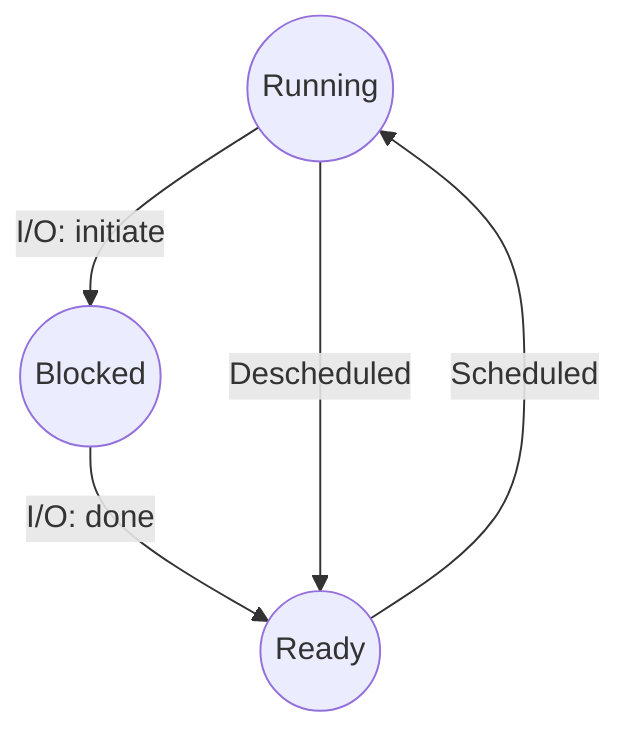

A process can be in one of three states (simplified)

1) Running
	- In the running state a process is running on a processor, this means it is executing instructions

2) Ready
	- In the ready state the process is ready to run but for some reason the OS has chosen not to run it at this given moment.

3) Blocked
	- In the blocked state a process has performed some kind of operation that makes it not ready to run until some other event takes place. 
	- A common example is when a process initiates a I/O request to a disk

(In UNIX systems a process that is in a final state where it has exited but has not yet been cleaned up is called ***Zombie state***)
